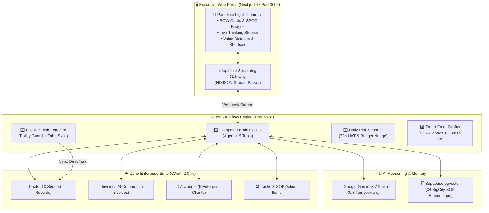

# 🤖 BCP Assist: AI Campaign Expert & Client Success Copilot

An enterprise AI execution layer and campaign copilot built with **Next.js 16**, **n8n Orchestrator**, **Google Gemini 3.7 Flash**, **Supabase pgvector**, and **Zoho CRM Suite**.

Designed specifically for **BigCity Promotions** to eliminate manual communication overhead, enforce Standard Operating Procedure (SOP) compliance, proactively flag campaign risks, and automate deal/task synchronization.

---

## 🏗️ System Architecture



---

## 🌟 Key Features

1. **AI Campaign Copilot & Knowledge Retrieval (RAG)**:
   - Queries 34 Standard Operating Procedure (SOP) tasks and historical campaign precedents using Supabase `pgvector`.
   - Formatted SOW responses with segment tagging (`[Confirmed Information]`, `[Historical Precedent]`, `[Risk]`, `[Recommendation]`, `[PENDING_HUMAN_SIGN_OFF]`).

2. **Live Zoho CRM Suite Integration**:
   - Native integration with **Deals**, **Invoices**, **Client Accounts**, and **Execution Tasks**.
   - Real-time commercial lookups and pending task tracking.

3. **Passive Task Extractor & Policy Guardrails**:
   - Parses unstructured client briefs from Slack/Email.
   - Enforces strict Human-in-the-Loop policy verification before creating live records in Zoho CRM.

4. **Proactive Daily Risk & Deadline Scanner**:
   - 9:00 AM daily cron audit checking the **72-Hour Pre-Launch UAT rule** and budget burn rates.

5. **Executive Web Portal**:
   - High-end porcelain editorial light theme.
   - Dynamic live reasoning stepper with elapsed timer.
   - One-click campaign context shortcuts (*Nestle Festive QR, Britannia 50-50, Samsung Diwali Mega*).
   - Voice input dictation via Web Speech API.
   - 1-click Markdown session export.

---

## ⚡ Quick Start

### 1. Prerequisites
- Docker & Docker Compose
- Node.js 18+ & npm

### 2. Start Backend Services (n8n & Postgres)
```bash
docker compose up -d
```
* n8n Webhook & Orchestrator: `http://localhost:5678`

### 3. Launch Frontend Portal
```bash
cd frontend
npm install
npm run dev
```
* Access the Executive Web App: `http://localhost:3000`

---

## 📁 Repository Structure

```text
├── frontend/                               # Next.js 16 Web Application
│   ├── src/
│   │   ├── app/
│   │   │   ├── api/chat/route.ts           # Streaming API gateway to n8n
│   │   │   ├── globals.css                 # Premium porcelain light theme
│   │   │   └── page.tsx                    # Main chat interface & sidebar
│   │   └── components/
│   │       ├── ChatMessage.tsx             # SOW visual cards & SPOC badges
│   │       ├── ThinkingProcess.tsx         # Live AI reasoning stepper & timer
│   │       ├── IntegrationStatus.tsx       # Interactive connected infrastructure
│   │       ├── EmptyState.tsx              # BigCity domain prompt cards
│   │       └── ChatInput.tsx               # Voice dictation & message input
├── workflows/                              # 4 Production n8n TypeScript workflows
│   ├── 01_campaign_brain_copilot.ts
│   ├── 02_passive_task_extractor.ts
│   ├── 03_daily_risk_nudge.ts
│   └── 04_smart_email_drafter.ts
├── docs/                                   # 5 Master documentation handbooks
│   ├── master_project_handbook.md
│   ├── tech_stack.md
│   ├── beginners_explanation.md
│   ├── workflow_blueprints.md
│   └── supabase_setup_guide.md
├── supabase_schema.sql                     # PostgreSQL schema with pgvector functions
├── seed_excel_tasks.sql                    # SQL seed script (34 SOP embeddings)
├── docker-compose.yml                      # n8n container definition
└── package.json
```

---

## 🔒 Security & Privacy

* **Zero-Leak Policy**: All `.env` secrets, API keys, and local data directories are strictly gitignored.
* **Human Sign-Off**: Financial and legal changes strictly require explicit human manager sign-off.
