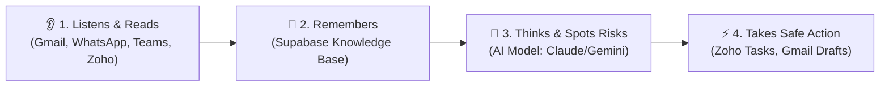

# 📖 Beginners Guide to BCP Assist (AI Campaign Expert & Client Success Manager)

Welcome! If you are new to AI agents, workflow automation, or n8n, this guide explains **what BCP Assist is, why it matters, and how it works in plain, simple English**.

---

## 1. What is BCP Assist in One Sentence?

> **BCP Assist is like having a super-experienced Senior Campaign Operations Manager working 24/7 inside your company—remembering every past campaign, spotting risks before they happen, organizing tasks, and drafting client replies.**

---

## 2. The Everyday Problem It Solves

Running marketing campaigns (like Scratch & Win contests, Cashbacks, Loyalty Programs, and Brand Rewards) involves multiple moving parts:
* **Scattered Information**: The client emails details via **Gmail**, internal discussions happen in **WhatsApp / Microsoft Teams**, tasks are logged in **Zoho Projects**, and money is tracked in **Zoho Books**.
* **Lost Experience**: If a senior campaign manager leaves or is busy, junior teams might repeat the exact same mistakes made a year ago (e.g. server crashes during high OTP traffic, vague T&C terms, delayed reward code generation).
* **Reactive Firefighting**: Teams often realize something is missing or delayed only *after* a client complains or a deadline is missed.

**BCP Assist turns your process from "Reactive Firefighting" into "Proactive, Intelligent Execution."**

---

## 3. How It Works: The 4 Superpowers

### 🦸‍♂️ Superpower 1: The Campaign Brain & Ideator
When a new campaign starts, you can chat with BCP Assist.
* **You ask**: *"We are launching a 100,000 QR-code cashback campaign for an FMCG snack brand. What should we keep in mind?"*
* **The Agent answers**: 
  1. *"We did a similar campaign for Brand X in 2024."*
  2. *"Risk alert: In that campaign, SMS OTPs had a 5-minute delay on launch day. We recommend using a backup SMS gateway."*
  3. *"Here is the recommended 7-step checklist from our internal SOP."*

---

### 🦸‍♂️ Superpower 2: The Automatic Task Notetaker
During the day, clients and internal teams discuss things in WhatsApp groups or MS Teams calls:
* *Example message*: *"Hey team, we need to get legal sign-off on the voucher T&C by Thursday 3 PM."*
* BCP Assist **listens (read-only)**, recognizes that this is an action item, and **automatically creates the task in Zoho Projects** assigned to the Legal lead with the deadline attached.

---

### 🦸‍♂️ Superpower 3: The Morning Risk Inspector (Proactive Nudge)
Every morning at 9:00 AM, BCP Assist automatically scans all live projects:
* It looks at upcoming deadlines in **Zoho Projects** and budgets in **Zoho Books**.
* If a campaign is launching in 48 hours but the UAT testing task is still incomplete, it sends a polite **Nudge Alert** to the Campaign Manager:
  > **⚠️ Risk Alert**: FMCG Festive Campaign launches in 2 days, but UAT sign-off is pending. Please verify with the Tech lead today.

---

### 🦸‍♂️ Superpower 4: The Smart Email Assistant (With Safety Brakes)
When a client sends an email asking for a campaign status or timeline:
* BCP Assist reads the email, checks the latest status from Zoho, and **drafts a professional reply directly in your Gmail Drafts folder**.
* **Important**: It **never sends the email by itself**. The human account manager opens the draft, verifies it, and clicks "Send."

---

## 4. The "Safety Brake" (Human-in-the-Loop)

AI is powerful, but high-stakes decisions should always be made by humans. Per company policy, BCP Assist has strict boundaries:

| ❌ What BCP Assist Can NEVER Do Alone | ✅ What BCP Assist DOES Instead |
| :--- | :--- |
| Cannot approve Legal terms or contracts | Flags the legal clause and asks the Legal team to review |
| Cannot approve budgets or financial discounts | Summarizes the spend and alerts the Finance manager |
| Cannot change live campaign mechanics | Identifies the issue and suggests options for the team to choose |
| Cannot send emails directly to clients | Prepares a ready-to-send draft in Gmail for human review |

---

## 5. Summary of Tools Used & Why

* **n8n**: The visual engine that connects all the pipes (triggers, schedules, workflows).
* **Supabase**: The cloud memory bank that stores historical campaign learnings and documents.
* **Claude 3.7 & Gemini 2.0**: The AI brains that do the reading, reasoning, and writing.
* **Zoho Suite**: The central source of truth for your deals, tasks, and budgets.
