# 📘 BCP Assist: Master Architecture & Executive Project Handbook

> **Project Name**: BCP Assist (AI Campaign Expert & Client Success Manager)  
> **Client / Organization**: BigCity Promotions  
> **Tech Stack**: n8n (Orchestration) + Supabase (`pgvector` & PostgreSQL) + Google Gemini (LLM & Embeddings) + Zoho Suite + Google Workspace  
> **Version**: 1.0 (Production Blueprint)

---

## 📑 Table of Contents
1. [What is the Project?](#1-what-is-the-project)
2. [Why Do We Need It? (The Real-World Problem)](#2-why-do-we-need-it-the-real-world-problem)
3. [How Have We Solved It? (The Solution Architecture)](#3-how-have-we-solved-it-the-solution-architecture)
4. [Where Does It Get Its Data From? (Data Sources & Ecosystem)](#4-where-does-it-get-its-data-from-data-sources--ecosystem)
5. [Why is Supabase Needed? (And Why Zoho Alone Isn't Enough)](#5-why-is-supabase-needed-and-why-zoho-alone-isnt-enough)
6. [Why 4 Modular Workflows Instead of 1 Giant Workflow?](#6-why-4-modular-workflows-instead-of-1-giant-workflow)
7. [Where Do Users Chat & Interact? (User Touchpoints)](#7-where-do-users-chat--interact-user-touchpoints)
8. [How is n8n Hosted? (Tunnels Today vs. Production Tomorrow)](#8-how-is-n8n-hosted-tunnels-today-vs-production-tomorrow)
9. [How Does n8n Connect to Zoho CRM, Books, Invoices & Projects?](#9-how-does-n8n-connect-to-zoho-crm-books-invoices--projects)
10. [Handling Years of Historical Zoho Data (The Backfill / ETL Process)](#10-handling-years-of-historical-zoho-data-the-backfill--etl-process)
11. [Speed & Token Efficiency with High-Volume Data (Architecture of Scale)](#11-speed--token-efficiency-with-high-volume-data-architecture-of-scale)
12. [Safety Boundaries & Human-in-the-Loop Policy Guardrails](#12-safety-boundaries--human-in-the-loop-policy-guardrails)

---

## 1. What is the Project?

**BCP Assist** is an enterprise AI execution layer and campaign copilot designed specifically for **BigCity Promotions**. 

It acts as an **always-on Senior Campaign Operations Director and Client Success Manager**. It sits in the middle of your daily business tools—reading campaign briefs, monitoring team chats, tracking milestone deadlines, checking client budgets, and drafting communications. 

It does not replace human managers; instead, it empowers every department (Sales, Client Servicing, Tech, Operations, Legal, Finance) with **instant institutional memory, automated task logging, and proactive risk detection**.

---

## 2. Why Do We Need It? (The Real-World Problem)

Running high-stakes sales promotions (such as *100k on-pack QR code cashbacks, Scratch & Win contests, and Brand Loyalty programs*) is complex and fast-paced. Agencies and promotional marketing teams face 4 systemic bottlenecks:

```mermaid
flowchart LR
    subgraph Traditional["🔴 Without BCP Assist: Reactive Bottlenecks"]
        direction TB
        P1["1. Scattered Data\n(Briefs in CRM, chats in WhatsApp, tasks in Projects)"]
        P2["2. Lost Memory\n(Past outage learnings leave with employees)"]
        P3["3. Firefighting\n(Deadlines & missing T&C caught 24h before launch)"]
        P4["4. Manual Drudgery\n(Hours spent transcribing chats into Zoho)"]
    end

    subgraph Solved["🟢 With BCP Assist: Proactive Execution"]
        direction TB
        S1["1. Single Knowledge Plane\n(Unified across Zoho, Gmail & WhatsApp)"]
        S2["2. Permanent Vector Brain\n(100% past campaign precedents stored)"]
        S3["3. Morning Risk Scanner\n(72h UAT & budget alerts at 9 AM daily)"]
        S4["4. Auto Ingestion & Drafts\n(Instant task logging & Gmail draft QA)"]
    end

    Traditional ==> Solved
```

**BCP Assist shifts the organization from reactive firefighting to proactive, intelligence-led execution.**

---

## 3. How Have We Solved It? (The Solution Architecture)

We built an event-driven AI ecosystem combining **n8n**, **Supabase (`pgvector`)**, **Google Gemini**, and a strict **Human-in-the-Loop Policy Gatekeeper**:

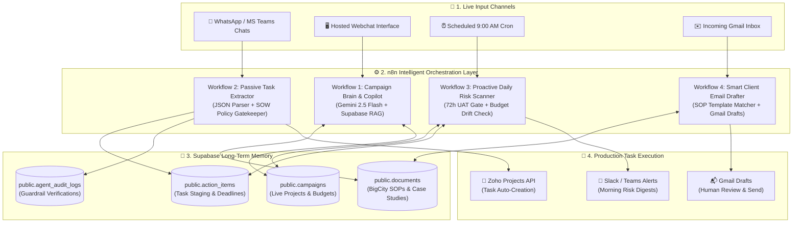

1. **Listen**: Passive listeners ingest communication from WhatsApp, Teams, Gmail, and Zoho.
2. **Remember**: Supabase retrieves matching SOPs, task templates, and historical campaign debriefs using semantic vector search.
3. **Reason**: Google Gemini (`gemini-2.5-flash`) extracts structured entities, evaluates risks, and formulates strategies.
4. **Guard**: An automated policy node checks if actions involve Legal, Financial, or Mechanics changes.
5. **Act**: Creates tasks in Zoho Projects, alerts managers on high-risk bottlenecks, and queues ready-to-send drafts in Gmail.

---

## 4. Where Does It Get Its Data From?

BCP Assist ingests data from 6 connected pillars:

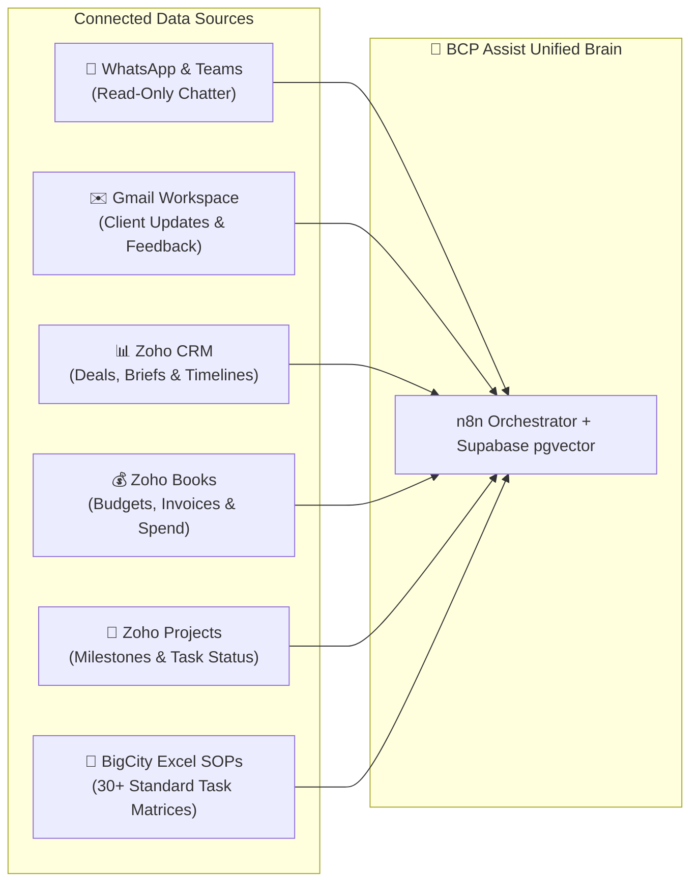

---

## 5. Why is Supabase Needed? (And Why Zoho Alone Isn't Enough)

Zoho is an **operational transactional database**—it stores rows of active tasks and contact forms. It **cannot** perform AI semantic search or store unstructured institutional memory.

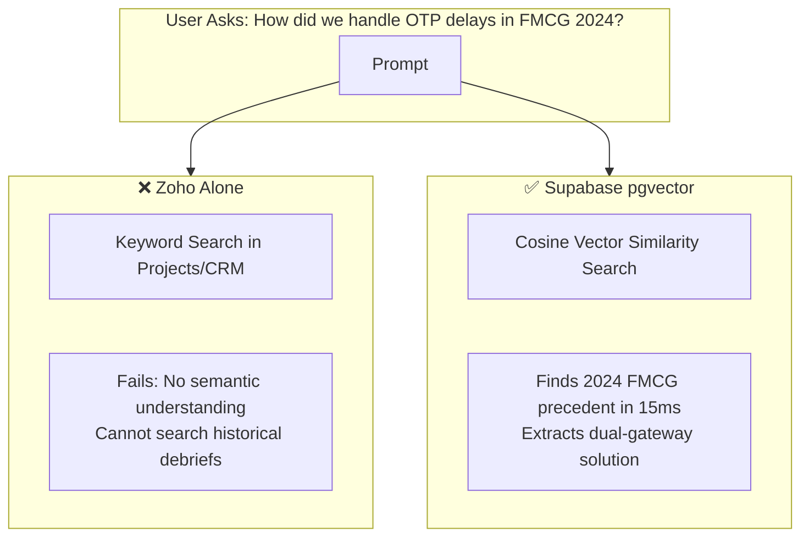

**Supabase is the "Long-Term Brain" that connects past experience with live Zoho execution.**

---

## 6. Why 4 Modular Workflows Instead of 1 Giant Workflow?

In production workflow engineering, building a single monolithic workflow is an anti-pattern. We use a **Microservice Workflow Architecture**:

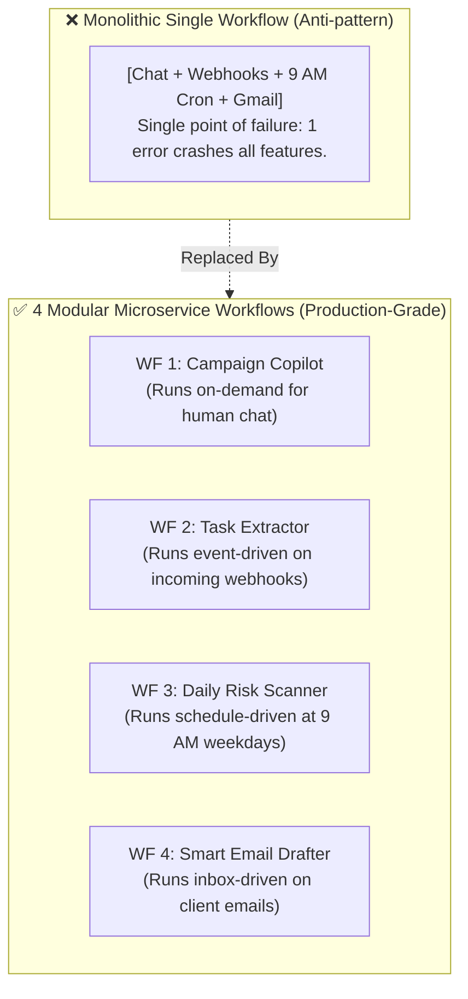

---

## 7. Where Do Users Chat & Interact?

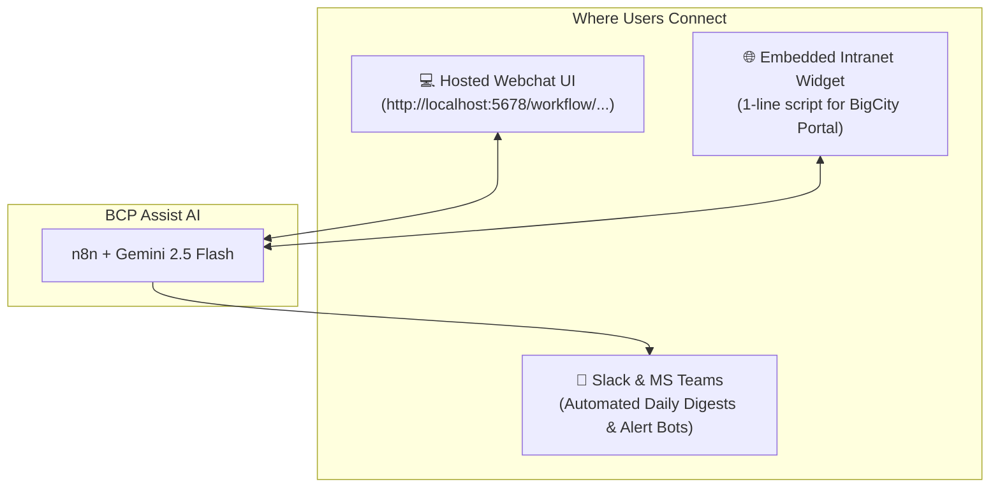

---

## 8. How is n8n Hosted? (Tunnels Today vs. Production Tomorrow)

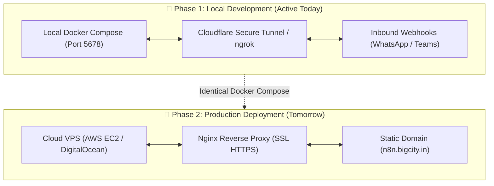

---

## 9. How Does n8n Connect to Zoho CRM, Books, Invoices & Projects?

n8n communicates with Zoho through the official **Zoho REST APIs** using **OAuth 2.0 (Server-based Application)**:

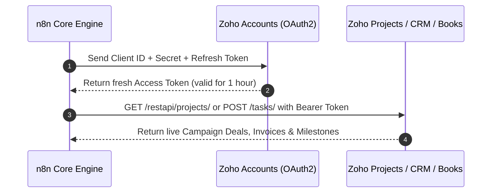

---

## 10. Handling Years of Historical Zoho Data (The Backfill / ETL Process)

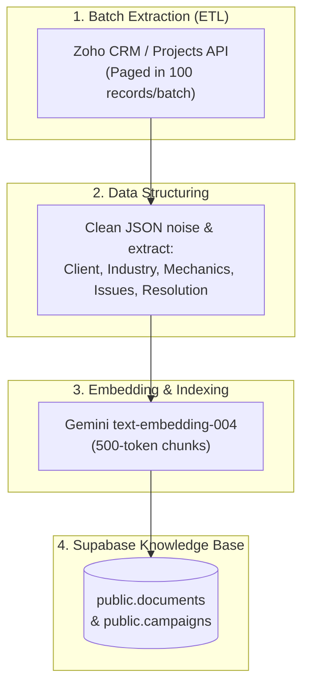

---

## 11. Speed & Token Efficiency with High-Volume Data

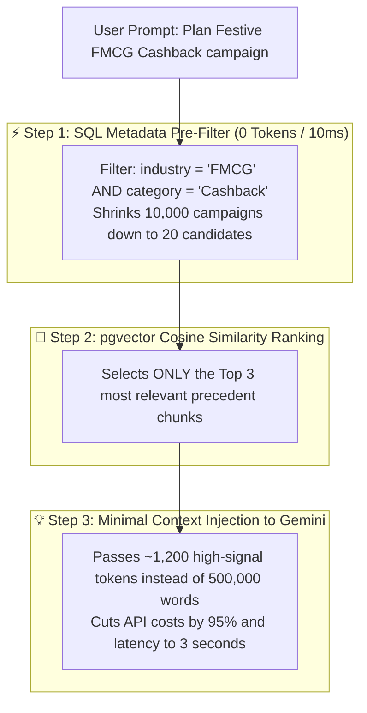

---

## 12. Safety Boundaries & Human-in-the-Loop Policy Guardrails

Per Section 7 of the SOW, AI is strictly forbidden from making autonomous financial or legal commitments:

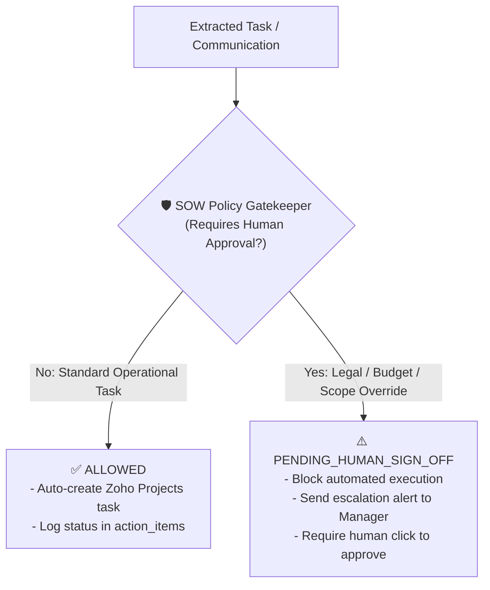

* ❌ **AI Never Sends Emails Autonomously**: Only creates Gmail drafts.
* ❌ **AI Never Overrides Budgets**: Flags financial deviations to Finance / Prashant Mittal.
* ❌ **AI Never Signs Off on Legal T&C**: Routes legal clauses to CS Heads / Legal SPOC.

---

### 🏁 Summary

BCP Assist is an **enterprise-grade, memory-backed AI execution engine**. It connects the dots between your team's conversations, historical experience, and Zoho task execution—giving BigCity Promotions an unfair operational advantage in speed, consistency, and client satisfaction.
