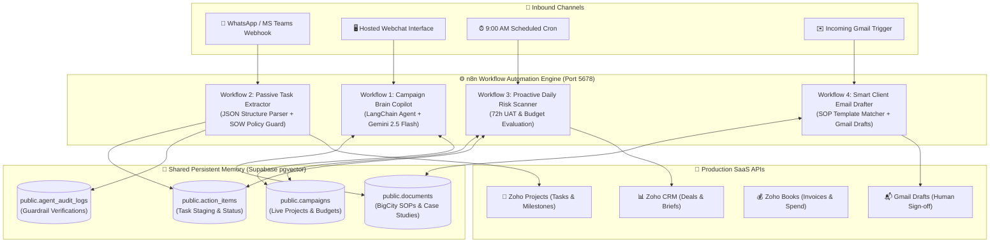
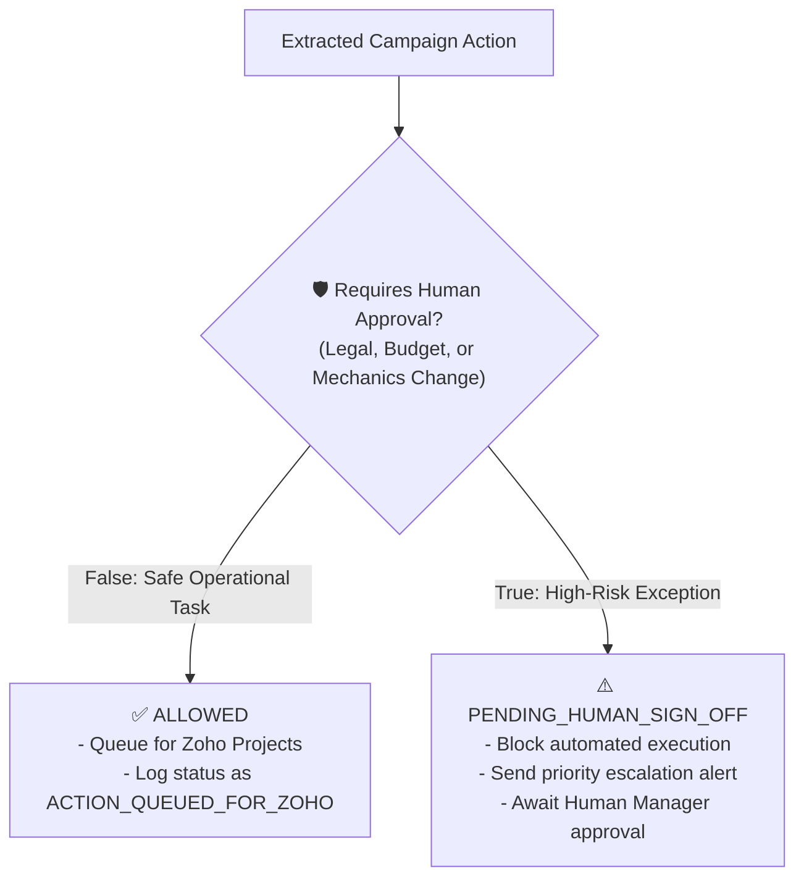
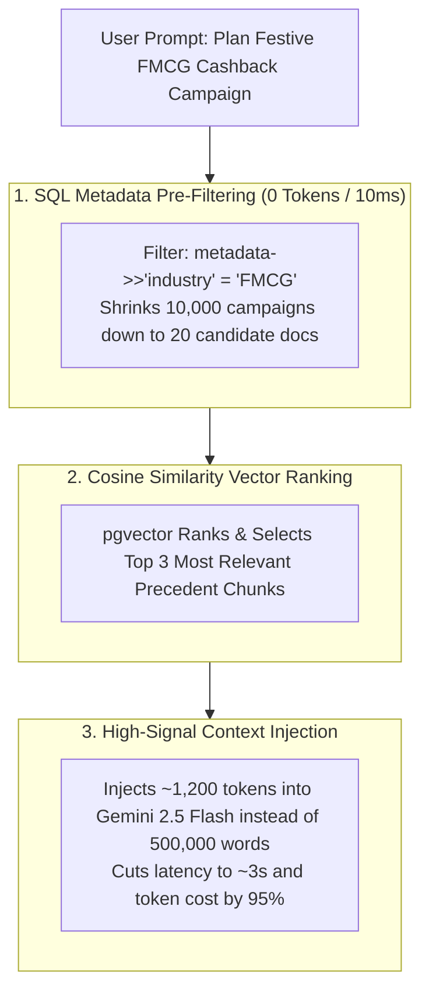

# 🏗️ BCP Assist: Technical Stack & Architecture Specification

---

## 🎯 Architecture Diagram

---

## 🔒 Policy Guardrail & SOW Compliance Flow

---

## ⚡ High-Volume Speed & Token Efficiency Pipeline

